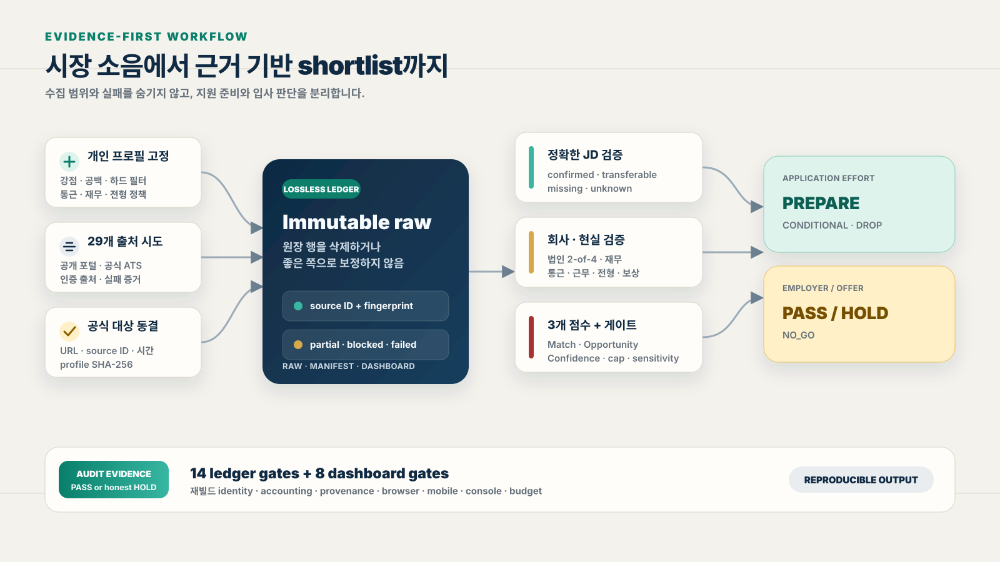

# Realistic Job Market Research

**Realistic Job Market Research**는 Codex와 Claude Code에서 함께 쓰는 공개 Agent Skill입니다. 공개 채용공고의 수집 범위를 감사 가능한 원장으로 보존하고, 로컬 후보자 증거로 직무 매칭 점수와 현실적인 지원 우선순위를 계산합니다.

An evidence-first Agent Skill for Codex and Claude Code that audits public job postings, builds a lossless job-market ledger, and ranks roles against a private local candidate profile.

[English quickstart](README.en.md)


공고를 많이 보여주는 데서 끝나지 않습니다. 선언한 공개 출처를 모두 시도하고, 실제로 회수한 공고에서 정확한 JD·후보자 경력·법인 신원·최신 재무·통근 또는 근무정책·채용 피로도·보상을 검증해 지원 가치가 있는 소수 후보로 좁힙니다. Codex와 Claude Code는 같은 `SKILL.md`, 수집기, 정책, 검증기를 사용합니다.

> 핵심 결과: `공고가 그럴듯하다`가 아니라 `왜 준비할 가치가 있고, 무엇이 미확인이라 아직 입사 판단은 보류인지`를 구분합니다.

## 이 스킬을 쓰면 얻는 이점

### 1. 일부 검색 결과를 전체 시장으로 착각하지 않게 됩니다

- 29개 등록 출처마다 검색 범위·질의·페이지네이션 종료 조건을 먼저 선언합니다. 현재 구현은 실수집 어댑터 13개, 접근 probe 15개, 인증 브라우저 handoff 1개이며 이 구분을 manifest에 보존합니다.
- 수집 성공 출처뿐 아니라 `partial`, `blocked`, `failed` 출처도 zero-row 증거와 실패 이유를 남깁니다.
- 검색 페이지에 표시된 총건수를 실제로 회수한 공고처럼 만들지 않습니다.
- 100행 단위 대시보드 페이지네이션은 화면 렌더링만 나눌 뿐 원장 행을 버리지 않습니다.

따라서 “어디까지 봤고 어디는 못 봤는지”가 숫자와 manifest로 남습니다. 인터넷 전체를 봤다는 과장 대신 **검증 가능한 커버리지**를 얻게 됩니다.

### 2. 신규·재게시·기존 누락·마감 공고를 구분합니다

새 URL이나 새 제목만으로 신규 공고라고 판단하지 않습니다.

- source ID와 현재 상세 본문을 이전 원장과 비교합니다.
- 같은 역할이 다른 포털에 다시 올라온 경우 `reposted`로 분리합니다.
- 이전 원장에는 있었지만 상위 검토에서 빠진 공고는 `previously_missed`로 표시합니다.
- 공식 상세가 사라지고 일반 채용 목록으로 돌아가면 마감 가능성을 다시 검증합니다.
- JD의 필수요건·고용형태·근무지·전형이 달라졌다면 `materially_changed`로 취급합니다.

이 덕분에 같은 공고를 새 기회로 오인해 반복 조사하는 시간을 줄이고, 진짜 변화만 볼 수 있습니다.

### 3. 직함과 기술 태그에 속지 않습니다

`AI Engineer`, `AI Agent`, `Applied AI`라는 제목만으로 적합도를 올리지 않습니다. 정확한 상세 JD 본문이 없으면 적합도는 `UNKNOWN`입니다.

각 필수요건을 후보자 증거와 일대일로 대조합니다.

| 판정 | 의미 |
|---|---|
| `confirmed` | 날짜와 출처가 있는 경력 증거가 정확히 존재 |
| `transferable` | 인접 경험은 있지만 요구사항 자체는 미증명 |
| `missing` | 필수요건과 실제 경력이 불일치 |
| `unknown` | JD 또는 후보자 자료가 부족 |

학위 하한, 학위 취득 후 경력, 고객 대면, 영어, 특정 언어·클라우드·메시지큐·관측성 도구, 트래픽 규모처럼 서류 탈락을 만드는 조건을 별도로 확인합니다. 우대사항을 필수조건으로 과장하지도 않고, 필수조건을 “비슷한 경험”으로 덮지도 않습니다.

### 4. 다른 회사의 재무를 잘못 붙이는 사고를 막습니다

재무를 보기 전에 고용 법인을 먼저 확정합니다. 다음 네 가지 중 최소 두 가지가 맞아야 합니다.

1. 공식 홈페이지 도메인
2. 대표자 또는 정확한 법인명
3. 동·호수까지의 주소
4. 설립일 또는 사업자 식별자

신원 확인을 통과하지 못하면 매출과 영업손익은 `UNVERIFIED`입니다. 동명이인, 계열사, 분리법인, 같은 주소를 쓰는 법인의 수치를 조용히 섞지 않습니다.

재무 출처도 `공시·감사보고서 → 거래소·공식 IR → 신용평가사 기반 포털 → 공시를 인용한 보도 → 회사 자기기재` 순으로 봅니다. 수치가 충돌하면 평균내지 않고 연도와 출처를 모두 남깁니다.

### 5. 흑자라는 한 단어보다 실제 고용 위험을 봅니다

- 한 해 흑자 전환과 수년 연속 흑자를 구분합니다.
- 초기 스타트업의 런웨이 위험과 오래된 기업의 만성 적자를 분리합니다.
- 자회사라면 모회사 재무와 분리 배경도 함께 확인합니다.
- 매출·영업손익뿐 아니라 누적결손, 부채, 현금, 투자 단계, 인력 변동을 가능한 범위에서 기록합니다.
- 재무가 좋더라도 직급 하향이나 보상 하한 부재는 별도 위험으로 남깁니다.

결과적으로 기술 적합도가 높아도 같은 재무 위험을 반복할 회사는 후순위 또는 `NO_GO`로 분리할 수 있습니다.

### 6. 통근·재택·채용 여정을 실제 지원비용에 포함합니다

회사 주소가 단순히 “서울”이나 “강남구”라고 적혔다는 이유로 통근을 좋게 평가하지 않습니다.

- 정확한 오피스 또는 역명
- 환승 횟수와 사용자가 정한 기준점
- 주당 의무 출근일
- 재택·시차출퇴근·이사 지원
- 문앞-문앞이 아닌 역간 시간이라는 한계

를 분리해서 기록합니다.

채용 절차는 다음처럼 비용 등급으로 정리합니다.

| 등급 | 일반적인 의미 |
|---|---|
| `F0` | 면접 1~2회, 별도 테스트·과제·레퍼런스 없음 |
| `F1` | 면접 2~3회, 별도 테스트·과제 없음 |
| `F2` | 테스트·과제 하나 또는 레퍼런스가 추가됨 |
| `F3` | 테스트·과제와 다단계 면접 등 여러 부담이 겹침 |
| `UNKNOWN` | 현재 정확한 직무의 절차가 공개되지 않음 |

같은 회사의 다른 직무나 오래된 면접 후기는 현재 전형의 확정값으로 승계하지 않습니다.

### 7. “지원할 가치”와 “입사해도 되는 회사”를 분리합니다

대부분의 채용공고는 연봉이나 근무정책을 서류 제출 전에 모두 공개하지 않습니다. 모든 미확인값이 닫힐 때까지 아무것도 하지 않는 방식도 현실적이지 않습니다.

그래서 두 개의 판단 축을 사용합니다.

| 단계 | 상태 | 의미 |
|---|---|---|
| 지원 준비 | `PREPARE` | 필수 적합도가 높고 준비비용이 합리적 |
| 지원 준비 | `CONDITIONAL` | 중요한 공백이나 미확인값을 먼저 닫아야 함 |
| 지원 준비 | `DROP` | 마감·필수 불일치·위험·과도한 준비비용 |
| 회사·오퍼 | `PASS` | 필수요건·법인·재무·보상·근무정책·전형이 모두 확인됨 |
| 회사·오퍼 | `HOLD` | 하나 이상의 중요한 조건이 미확인 또는 협상 필요 |
| 회사·오퍼 | `NO_GO` | 사용자 하드 필터 또는 검증된 위험과 충돌 |

따라서 `PREPARE / HOLD`라는 현실적인 결론을 낼 수 있습니다. 서류는 준비할 가치가 있지만 회사 선택은 아직 보류라는 뜻입니다.

### 8. 매칭 점수가 감이 아니라 근거와 가중치로 계산됩니다

한 숫자에 모든 판단을 섞지 않고 세 점수와 별도 증거 품질을 보여줍니다.

| 점수 | 답하는 질문 |
|---|---|
| `JD Match Score` | 실제 업무와 필수요건을 수행할 경력 증거가 얼마나 있는가 |
| `Opportunity Score` | 재무·통근·전형·보상까지 포함했을 때 나에게 얼마나 좋은 기회인가 |
| `Evidence Coverage` | 위 판단에 필요한 항목이 얼마나 채워졌는가 |
| `Evidence Quality` | 출처 품질과 최신성이 순위에 쓸 수준인가 |

필수요건은 `confirmed=100`, `transferable=55`, `missing/unknown=0`이며 평균이 아니라 최약 필수요건을 사용합니다. JD 문장을 잘게 쪼개 점수를 부풀릴 수 없고, 하드 제외·마감·필수 누락은 `0·49·59·74` 게이트로 차단됩니다.

이 숫자는 합격 데이터를 학습한 예측치가 아니라 상태 경계를 강제하는 보수적 정책값입니다. 예를 들어 필수요건 `missing`의 Match 상한 `59`는 `SOLID` 진입을 막고, Opportunity 상한 `49`는 재무·통근이 좋아도 `LOW` 밖으로 나가지 못하게 합니다. 필수요건 `unknown` 상한 `74`는 미확인 상태가 `STRONG`으로 표시되는 것을 막습니다.

기본 Opportunity 가중치는 `직무 매칭 45 · 재무 25 · 통근/근무정책 12 · 채용 피로도 8 · 보상/레벨 10`이며 로컬 프로필에서 버전 관리합니다. 세 민감도 프로필과 10,000회 결정론적 가중치 흔들림으로 top 빈도와 순위 범위도 출력합니다.

정확한 기본 산식은 다음과 같습니다.

```text
JD_raw = Σ(component score × component weight) / Σ(applicable weight)
Mandatory = min(all mandatory requirement values)
JD      = min(JD_raw, 59) if mandatory missing
          min(JD_raw, 74) if mandatory unknown

Opportunity_raw =
  (45×JD + 25×Finance + 12×Location + 8×Hiring + 10×Compensation) / 100

Coverage = Σ(resolved evidence points), maximum 100
```

예제에서는 우대요건이 없어 해당 가중치 `8`을 분모에서 제외합니다. `JD = 9,020 / 92 = 98.0434… → 98.0`, 이어서 반올림 전 JD를 사용해 `Opportunity = 8,491.9565… / 100 = 84.9195… → 84.9`, 증거점수는 `10+25+5+15+10+10+10+8+0 = 93.0`이 됩니다. 밴드와 순위는 반올림 전 값으로 결정하고 화면 표시만 소수점 첫째 자리로 반올림합니다.

점수는 합격 확률이 아닙니다. 계산 정본은 [`scoring-policy.default.json`](skills/realistic-job-market-research/assets/scoring-policy.default.json), 해설과 공식은 [`scoring-model.md`](skills/realistic-job-market-research/references/scoring-model.md)입니다.

### 9. 범용 이력서를 공고별로 어디부터 바꿀지 알 수 있습니다

단순히 JD 키워드를 이력서에 추가하지 않습니다.

- 필수요건 중 이미 증명된 경력
- 사실은 있지만 첫 화면에 묻힌 경력
- 인접 경험만 있는 요구사항
- 현재 자료로는 주장할 수 없는 공백
- 현직 창업자·사이드 프로젝트처럼 전념 우려를 만드는 신호

를 구분합니다.

회사 순서를 무리하게 뒤집기보다, 요약과 경력 bullet에서 어떤 증거를 먼저 보여줄지 제안합니다. 확인되지 않은 수치·고객 경험·대규모 운영 경험을 만들어내지 않습니다.

### 10. 조사 결과를 다음 실행에서 그대로 재현할 수 있습니다

각 실행은 새 run 디렉터리에 고정됩니다.

- source plan과 개인 프로필 SHA-256
- 출처별 immutable raw JSON
- source ID와 content fingerprint
- 중복·invalid·parser accounting
- manifest와 compact payload
- 리뷰 snapshot과 exact join key
- 14개 원장 게이트와 8개 대시보드 게이트
- 로컬 브라우저 QA와 재현성 증거

가 남습니다.

같은 raw와 같은 profile로 다시 빌드했을 때 행 identity와 집계가 같은지 확인할 수 있고, 이력서나 JD가 바뀌면 기존 리뷰가 자동으로 현재 판정인 척 승계되지 않습니다.

### 11. Codex와 Claude Code가 같은 기준으로 일합니다

공개 저장소 하나가 정본입니다.

- Codex와 Claude Code가 같은 `SKILL.md`를 읽습니다.
- 수집기·스키마·검증기·대시보드 템플릿도 같습니다.
- 같은 공개 저장소에서 설치본을 갱신하고 `doctor`로 Codex·Claude 경로를 함께 확인합니다.
- 개인 맞춤 프로필은 공개 Git 밖의 로컬 설정으로 유지됩니다.

에이전트마다 다른 지침을 복사해 두고 시간이 지나면서 판단 기준이 갈라지는 문제를 줄입니다.

## 사용 전후 비교

| 기존 방식 | 이 스킬 사용 후 |
|---|---|
| 검색 상위 몇 페이지를 전체 후보처럼 사용 | 선언한 29개 출처의 시도 범위와 실제 회수·실패 구간을 함께 보존 |
| 공고 제목과 태그로 적합도 판단 | 상세 JD의 필수요건과 후보자 증거를 항목별 대조 |
| 새 URL을 신규 공고로 간주 | 신규·재게시·기존 누락·마감·조건 변경을 분리 |
| 회사명이 비슷하면 재무를 연결 | 법인 신원 2-of-4를 통과한 뒤에만 재무 귀속 |
| 기술 핏만으로 지원 순위 결정 | 재무·통근·근무정책·전형·보상까지 AND 검토 |
| 근거가 보이지 않는 종합점수 | Match·Opportunity·Coverage·Quality와 component·가중치·cap을 함께 공개 |
| 미확인값을 추정하거나 좋은 쪽으로 해석 | `UNKNOWN`과 충돌 출처를 그대로 보존 |
| 지원 여부와 입사 판단을 한 점수로 표현 | `PREPARE`와 `PASS/HOLD/NO_GO`를 분리 |
| 조사 결과가 대화에서 사라짐 | raw·manifest·dashboard·audit로 재현 가능 |
| Codex와 Claude에 서로 다른 복사본 | 한 canonical skill을 양쪽에서 사용 |

## 처리 흐름



PNG가 필요한 문서·메신저에서는 [`media/workflow-overview.png`](media/workflow-overview.png)를 사용할 수 있습니다.

## 이미지와 공유

| 용도 | 파일 | 규격 |
|---|---|---|
| README hero·GitHub Social Preview | [`media/github-social-preview.png`](media/github-social-preview.png) | 1280×640 PNG |
| 일반 OG·메신저 공유 | [`media/social-preview.png`](media/social-preview.png) | 1200×630 PNG |
| 워크플로 문서·README | [`media/workflow-overview.svg`](media/workflow-overview.svg) | 1600×900 SVG |
| 워크플로 슬라이드·메신저 공유 | [`media/workflow-overview.png`](media/workflow-overview.png) | 1600×900 PNG |
| 원본 생성 일러스트 | [`media/brand/hero-background.png`](media/brand/hero-background.png) | 1536×1024 PNG |

공유 카드의 정확한 문구와 레이아웃 원본은 [`media/brand/social-preview.html`](media/brand/social-preview.html), 이미지 생성 provenance와 프롬프트는 [`media/brand/PROVENANCE.md`](media/brand/PROVENANCE.md)에 보존합니다.

## 얻게 되는 산출물

| 파일 | 역할 |
|---|---|
| `source-plan.json` | 출처·질의·종료조건·시도 상태의 실행 계약 |
| `profile.json` | 해당 실행에 고정된 후보자 조건과 원본 SHA |
| `official-targets.json` | 이번 실행에서 확인할 공식 ATS URL 목록 |
| `raw/<source>.json` | 가공 전 source별 공고와 수집 증거 |
| `reviewed/manual.json` | 상세 검토한 행의 exact fingerprint 판정 |
| `reviewed/ledger.json` | 중복과 충돌을 정리한 리뷰 원장 |
| `scored-review.json` | Match·Opportunity·Coverage·Quality, 계산식, cap, 민감도·강건성 순위 |
| `dist/manifest.json` | 수집량·중복·실패·coverage·review accounting 정본 |
| `dist/jobs.js` | 전체 필터 대시보드용 compact payload |
| `site/index.html` | 검색·출처·지역·경력·고용·coverage 필터 UI |
| `qa-evidence.json` | 재빌드·브라우저·성능·모바일 증거 |
| `audit.json` | 원장 14개·대시보드 8개 게이트 종합 판정 |

## 검증된 재현성

공개 저장소에는 제3자 공고 본문을 포함하지 않는 29-source 합성 fixture가 있습니다. `npm run reference`가 선언 출처 29개를 모두 materialize하고, 구현 어댑터 13개에는 합성 행 1개씩, probe 15개와 인증 handoff 1개에는 zero-row 증거를 만든 뒤 정본 집계와 exact 비교합니다.

별도의 비공개 2026-08-28 동결 raw도 같은 패키지로 재생해 29,469행 identity SHA, manifest mismatch 0, 40,001행 dashboard smoke, 원장·대시보드 audit PASS를 확인했습니다. 원문 재배포 권한이 확인되지 않은 제3자 본문은 공개하지 않으므로 이 수치는 공개 재현 fixture가 아니라 **owner attestation**입니다.

새 라이브 수집 결과가 달라지는 것은 정상이며, 같은 frozen raw에서 변환 결과가 달라지면 회귀입니다. 공개·비공개 검증의 경계와 명령은 [`references/reproducibility.md`](skills/realistic-job-market-research/references/reproducibility.md)를 참고하세요.

## 이 스킬이 보장하지 않는 것

- 인터넷 전체의 모든 공고를 수집했다고 주장하지 않습니다.
- 차단·로그인·CAPTCHA를 우회하지 않습니다.
- 공개되지 않은 연봉·근무정책·전형을 추정하지 않습니다.
- 합격 확률을 근거 없는 퍼센트로 제시하지 않습니다.
- 자동으로 지원·스크랩·메시지·프로필 변경을 하지 않습니다.
- 지원자의 허가 없이 개인정보나 채용담당자 연락처를 저장하지 않습니다.
- 재무와 직무 적합도가 좋아도 사용자가 정한 하드 제외 조건을 무시하지 않습니다.

후보가 없거나 전부 `HOLD`인 결론도 정상 결과입니다.

## 요구사항

- Node.js 20 이상
- Python 3.10 이상
- 공개 출처 수집을 위한 네트워크
- 실제 대시보드 QA 또는 인증 출처 확인 시 로컬 브라우저
- 개인 맞춤 사용 시 로컬 profile 설정

수집·점수 런타임은 Node.js·Python 표준 기능만 사용합니다. 브라우저 QA만 고정된 개발 의존성 Playwright를 사용합니다.

## 설치

Codex와 Claude Code에 전역 설치:

```bash
npx skills add joonyeonglim/realistic-job-market-research \
  -g -a codex -a claude-code -y
```

이 명령은 npm에 이 저장소를 패키지로 발행하는 방식이 아니라, `npx`로 [Skills CLI](https://github.com/vercel-labs/skills)를 실행해 GitHub의 canonical skill 디렉터리를 설치하는 방식입니다.

업데이트는 활성 에이전트 세션을 종료한 뒤 일반 터미널에서 실행합니다.

> 활성 Codex/Claude 세션 안에서 업데이트하면 `skills` CLI가 canonical 디렉터리를 교체하는 순간
> `SKILL.md: No such file or directory` 경고가 한 번 발생할 수 있습니다. 에이전트 세션을 닫은 일반
> 터미널에서 업데이트하고, 아래 검증 후 새 세션을 시작하세요.

```bash
npx skills update -g realistic-job-market-research -y
```

설치 확인:

```bash
npx skills ls -g --json
test -r ~/.agents/skills/realistic-job-market-research/SKILL.md
npx -y skills-ref validate \
  ~/.agents/skills/realistic-job-market-research
node ~/.agents/skills/realistic-job-market-research/scripts/doctor.mjs --global
```

`No such file or directory`가 지속되면 활성 세션을 종료한 뒤 최초 설치 명령을 다시 실행하고 Codex를
재시작합니다. 설치기의 비원자적 교체로 생긴 일시적 경고라면 반복 재설치하지 않습니다.

## 현재 한계와 로드맵

- 29개 출처 중 실수집 구현은 13개입니다. 나머지 15개는 probe, Remember는 인증 handoff이며 회수 공고로 세지 않습니다.
- 출처별 이용조건과 재배포 권한은 모두 `review_required`입니다. 라이브 수집은 정책 확인 플래그가 없으면 시작하지 않습니다.
- 점수는 합격 확률이 아닙니다. 실제 지원 결과가 30건 이상이고 긍정 결과가 5건 이상 쌓이기 전에는 예측 타당성을 주장하지 않습니다.
- 외부 `skills` CLI의 갱신은 비원자적일 수 있어 활성 에이전트 세션 밖에서 실행합니다.

수정 완료 항목과 남은 HOLD의 정확한 경계는 [`AUDIT.md`](AUDIT.md)에 공개합니다.

## 사용 예시

Codex:

```text
Use $realistic-job-market-research to attempt the declared job sources, preserve every coverage limit, and build the audited dashboard.
Use $realistic-job-market-research to research these roles realistically against my local profile.
```

Claude Code:

```text
/realistic-job-market-research 선언된 출처를 모두 시도하고 실제 수집 범위와 실패를 분리해 현실적인 후보만 정리해줘
/realistic-job-market-research 지난 원장과 비교해서 신규·재게시·마감 공고를 구분해줘
```

## 개인 맞춤 설정

개인 정보는 공개 저장소 밖에 둡니다.

설치본을 사용하는 아래 명령은 canonical skill 디렉터리에서 실행합니다. 저장소 clone에서 직접 실행할 때는 `skills/realistic-job-market-research`로 이동합니다.

```bash
cd ~/.agents/skills/realistic-job-market-research
node scripts/init-profile.mjs

python3 scripts/validate_profile.py \
  ~/.config/realistic-job-market-research/profile.json \
  --check-sources
```

프로필에는 목표 직무, 증명된 강점, 명시적 공백, 학력·경력, 하드 제외 조건, 재무·채용 피로도 정책, 통근 또는 근무정책 기준, 점수 가중치·민감도 프로필, 이력서 원본 경로와 SHA만 기록합니다. 전화번호·개인 이메일·상세 집주소·채용담당자 정보·자격증명은 기록하지 않습니다.

자세한 계약은 [`references/personalization.md`](skills/realistic-job-market-research/references/personalization.md)를 참고하세요.

## 선언 출처 census 실행

설치된 canonical skill 디렉터리에서:

개인화 없는 원시 census는 프로필 없이 실행할 수 있습니다. 개인 평가나 점수가 필요할 때만 위 프로필을 생성합니다.

```bash
node scripts/run-census.mjs \
  --run-dir /absolute/path/to/YYYY-MM-DD-ai-census \
  --acknowledge-source-policy
```

수집 없이 동결 raw를 재빌드할 때:

```bash
node scripts/run-census.mjs \
  --run-dir /absolute/run/path \
  --from-frozen-raw
```

## 리뷰 연결

raw를 수정하지 않고 상세 판정을 연결합니다.

```bash
node scripts/create-review-snapshot.mjs \
  --run-dir /absolute/run/path \
  --decisions /absolute/review-decisions.json

node scripts/run-census.mjs \
  --run-dir /absolute/run/path \
  --from-frozen-raw \
  --review-snapshot /absolute/run/path/reviewed/manual.json
```

자세한 절차는 [`references/review-workflow.md`](skills/realistic-job-market-research/references/review-workflow.md)를 참고하세요.

## 매칭 점수 계산

```bash
python3 scripts/score_review.py \
  --input /absolute/review.json \
  --profile ~/.config/realistic-job-market-research/profile.json \
  --output /absolute/scored-review.json
```

입력 예시는 [`assets/score-review.example.json`](skills/realistic-job-market-research/assets/score-review.example.json), 점수 연구·공식·기본 가중치는 [`references/scoring-model.md`](skills/realistic-job-market-research/references/scoring-model.md)에 있습니다.

## 감사

손으로 QA JSON을 작성하지 않습니다. 실행 증거와 스크린샷 SHA를 생성한 후 감사합니다.

```bash
npm install
npx playwright install chromium
node scripts/record-qa.mjs --run-dir /absolute/run/path
node scripts/audit-run.mjs \
  --run-dir /absolute/run/path \
  --qa /absolute/run/path/qa-evidence.json
```

브라우저·재현성 증거가 없으면 audit은 거짓 PASS 대신 `HOLD`합니다.

## 패키지 검증

```bash
npm test
npm run reference
python3 scripts/validate_profile.py --self-test
python3 scripts/validate_review.py --self-test
python3 scripts/score_review.py --self-test
node scripts/verify-reference-run.mjs \
  --run-dir /absolute/replayed-reference-run
```

## 호환성

- Codex: `skills/realistic-job-market-research/SKILL.md`, `agents/openai.yaml`, scripts, references, assets
- Claude Code: 동일한 canonical `SKILL.md`; `/realistic-job-market-research`로 호출
- 설치·업데이트: [`skills`](https://github.com/vercel-labs/skills)

공식 규격: [OpenAI Skills](https://learn.chatgpt.com/docs/build-skills) · [Claude Code Skills](https://code.claude.com/docs/en/skills) · [Agent Skills](https://agentskills.io)

## 라이선스

MIT
